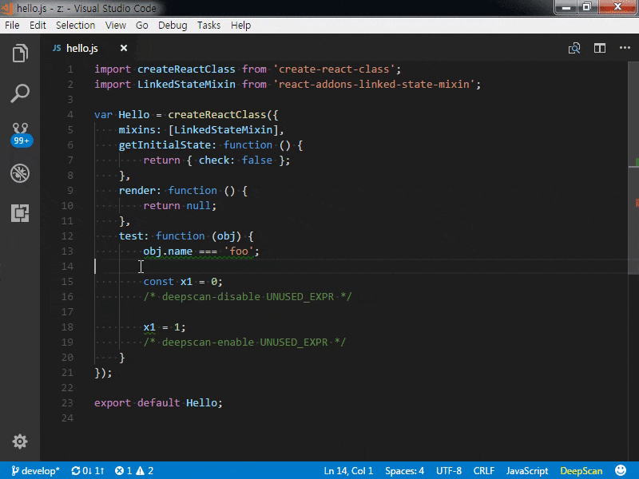

# VS Code DeepScan extension

[](https://marketplace.visualstudio.com/items/DeepScan.vscode-deepscan)
[](https://deepscan.io/dashboard/#view=project&pid=1808&bid=7873)

[VS Code extension](https://marketplace.visualstudio.com/items/DeepScan.vscode-deepscan) to detect bugs and quality issues in JavaScript, TypeScript, React and Vue.js. Works with [DeepScan](https://deepscan.io).

DeepScan is a cutting-edge JavaScript code inspection tool that helps you to find bugs and quality issues more precisely by data-flow analysis. You can also use it for React and Vue.js because DeepScan delivers [React specialized rules](https://deepscan.io/docs/rules/#react) and [Vue.js specialized rules](https://deepscan.io/docs/rules/#vue).

**Note**: DeepScan Lite plan or above is needed to use this extension. Visit [deepscan.io](https://deepscan.io/pricing) to gain access to a 14-day free trial.


## How It Works

- Report issues in Problems panel when you open a `*.js`, `*.jsx`, `*.mjs`, `*.ts`, `*.tsx`, and `*.vue` file and save it.
- Highlight issues in the code.
- Show a rule description using a code action. When you click the light bulb of the issue, you can see the detailed description of the rule and grasp what's the problem.

## File Transfer

To use this extension, you should confirm that your code is transferred to the DeepScan server for inspection when you save your changes.
You can confirm it by pressing the Confirm button that appears when restarting VS Code after the installation.

Note that your code is completely deleted from the server right after the inspection.

## DeepScan Access Token

An access token is needed to inspect your code at the DeepScan server. Follow [instructions](https://deepscan.io/docs/deepscan/vscode#token) at the DeepScan site to generate the token.

For managing access token, this extension contributes the following commands to the Command Palette:

- **Configure Access Token**: register the token generated at the DeepScan site.
- **Delete Access Token**: remove the currently registered token from VS Code. (The token at the server remains unaffected.)
- **Show Access Token Info**: display the name and expiration date of the current token.

## Settings Options

This extension contributes the following variables to the settings:

- `deepscan.enable`: enable/disable DeepScan. Disabled by default. Enabled on per workspace when you confirm.
- `deepscan.server`: set an url of DeepScan server. "https://deepscan.io" by default.
- `deepscan.proxy`: set an url of proxy server. When you are [behind a proxy](#using-behind-a-proxy).
- `deepscan.ignoreRules`: set an array of rules to exclude.
  An example to exclude 'UNUSED_DECL' rule:
```json
{
    "deepscan.ignoreRules": [
        "UNUSED_DECL"
    ]
}
```
- `deepscan.ignorePatterns`: set an array of file patterns to exclude.
  An example to exclude a file and `lib` directory:
```json
{
    "deepscan.ignorePatterns": [
        "App.vue", "lib/"
    ]
}
```
- `deepscan.fileSuffixes`: set an array of additional suffixes for files to analyze.
  An example to analyze `*.es` file as a JavaScript file:
```json
{
    "deepscan.fileSuffixes": [
        ".es"
    ]
}
```
- `deepscan.showDecorators`: enable/disable to show high and medium problems with inline decorators. Enabled by default.


### Disabling Rules with Inline Comments

While you can exclude rules project wide via `deepscan.ignoreRules` option, you can also disable a rule in a file using inline comment.
```javascript
const x = 0;
x = 1; x + 1; // deepscan-disable-line UNUSED_EXPR
```

By **Ignore this line** and **Ignore this rule** code actions, you can add an inline comment easier.



Read more about it [here](https://deepscan.io/docs/get-started/disabling-rules/).

## Using behind a Proxy

To do an inspection, this extension requires a connection with the DeepScan server. But this connection cannot be established when you are behind a proxy.

For this case, you can try one of the following:

* Set `http_proxy` environment variable: `http_proxy` [is respected](https://www.npmjs.com/package/axios#request-config), if any.
* Set `deepscan.proxy` option: When you do not have/want a system-wide `http_proxy` environment variable, you can set the proxy server's URL in the `deepscan.proxy` option.
